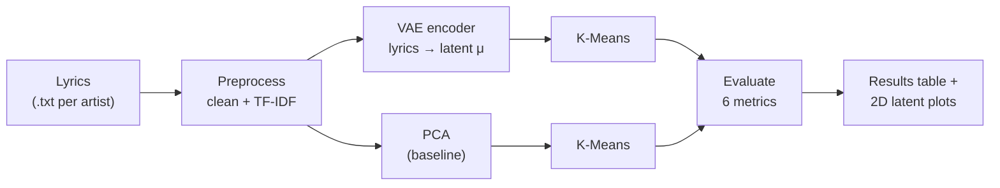
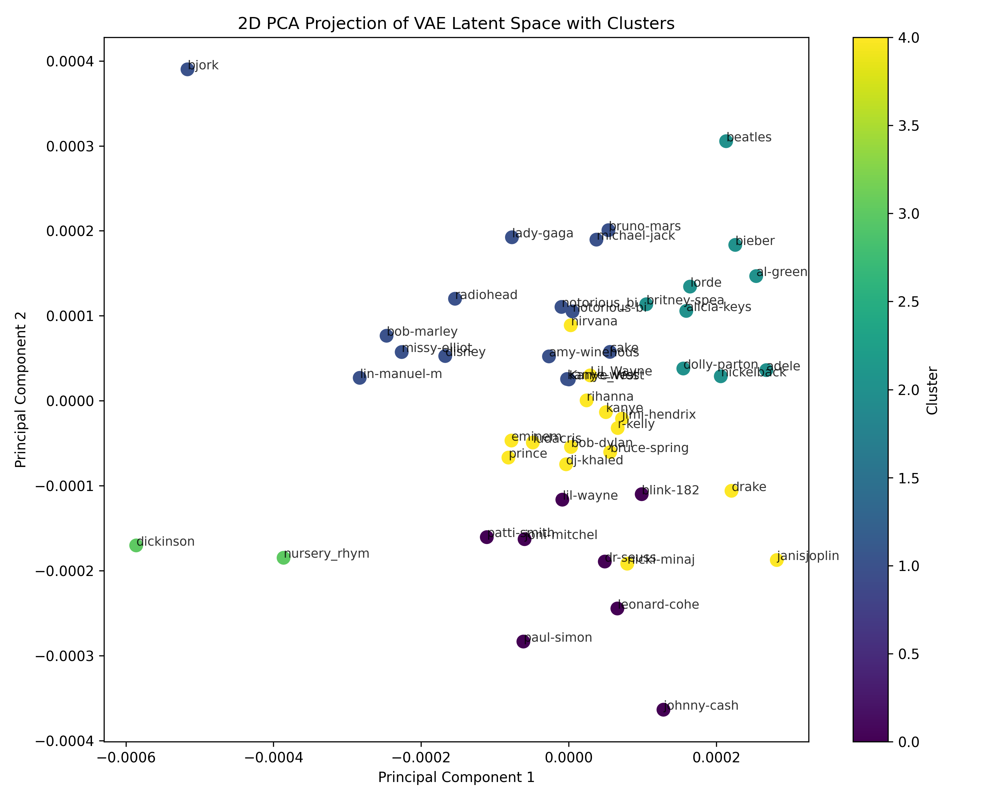

# VAE for Hybrid-Language Music Lyrics Clustering

**Can a model discover musical styles from words alone, with no labels and no audio?**

This project learns a compact "style space" for song lyrics with a **Variational Autoencoder (VAE)**, then groups songs into clusters such as rap, pop, ballad or poetic writing. It compares the VAE against a classic **PCA** baseline using six clustering metrics, so every claim about "better clusters" is backed by numbers.


---

## Why this matters

Music platforms organize songs by genre tags that are often missing, inconsistent or too coarse, especially for **hybrid-language and code-mixed lyrics** (songs that mix languages within a verse). Lyrics carry a lot of style signal on their own: vocabulary, repetition, rhyme density, sentence length, tone.

The vision is a **label-free way to map lyrical style** that:
- works when genre labels don't exist,
- can group songs across languages by *how* they are written, not only by *which* language,
- gives a latent space you can explore, visualize and build recommendations on.

## How it works



1. **Features:** each song becomes a TF-IDF vector (which words matter, weighted by how distinctive they are).
2. **Representation learning:** the VAE compresses that vector into a small latent vector. The encoder's mean (μ) is used as the song's "style fingerprint".
3. **Clustering:** K-Means groups the fingerprints.
4. **Baseline:** the same pipeline with PCA instead of the VAE, to check that the VAE actually adds value.
5. **Evaluation:** internal metrics (no labels needed), plus external metrics when artist or genre labels are available.

## Results

> Run the notebook to generate `results/clustering_metrics.csv`, then copy the numbers here.

| Method | Silhouette ↑ | Calinski-Harabasz ↑ | Davies-Bouldin ↓ | ARI ↑ | NMI ↑ | Purity ↑ |
|---|---|---|---|---|---|---|
| PCA + K-Means | | | | | | |
| VAE + K-Means | | | | | | |



**Key findings:** *(2-3 sentences: did the VAE beat PCA, on which metrics, and what do the clusters look like?)*

## Quick start

```bash
git clone https://github.com/<owner>/VAE-for-Hybrid-Language-Music-Clustering.git
cd VAE-for-Hybrid-Language-Music-Clustering
python -m venv .venv
.venv\Scripts\activate          # macOS/Linux: source .venv/bin/activate
pip install -r requirements.txt
```

Add lyrics as one `.txt` file per artist in `data/lyrics/` (see [Data](#data)).

### Run the notebook (recommended)
1. Open the project folder in VS Code and open `notebooks/exploratory.ipynb`.
2. Select the interpreter: `Ctrl + Shift + P` → **Python: Select Interpreter** → your `.venv`.
3. Run the cells top to bottom:

| Cell | What it does |
|---|---|
| 1 | Imports and path setup |
| 2 | Load and preprocess lyrics (TF-IDF) |
| 3 | Train the VAE and extract latent features |
| 4 | Cluster with K-Means (VAE and PCA) |
| 5 | Unsupervised metrics |
| 6 | Supervised metrics (optional, needs labels) |
| 7 | Visualize and save results |

Outputs are written to `results/`:
- `clustering_metrics.csv`: comparison table
- `latent_visualization/vae_latent_clusters.png`: 2D scatter plot of the latent space

## Project structure

```
VAE-for-Hybrid-Language-Music-Clustering/
├── data/
│   └── lyrics/                  # one .txt per artist (not committed, see Data)
├── notebooks/
│   └── exploratory.ipynb        # main interactive workflow
├── src/
│   ├── dataset.py               # loading + TF-IDF feature extraction
│   ├── vae.py                   # VAE model + training loop
│   ├── clustering.py            # K-Means on latents + PCA baseline
│   └── evaluation.py            # 6 clustering metrics
├── results/
│   ├── latent_visualization/    # saved plots
│   └── clustering_metrics.csv   # metric comparison
├── requirements.txt
└── README.md
```

| Module | Responsibility |
|---|---|
| `src/dataset.py` | Reads every `.txt` lyric file and builds the TF-IDF matrix |
| `src/vae.py` | VAE definition and training; encodes lyrics into latent vectors (μ) |
| `src/clustering.py` | `perform_clustering` (K-Means on VAE latents) and `pca_baseline` (PCA + K-Means) |
| `src/evaluation.py` | All clustering metrics below |

## Evaluation metrics

| Metric | Needs labels? | What it tells you | Better |
|---|---|---|---|
| Silhouette Score | No | How well each song fits its own cluster vs the nearest other one | Higher |
| Calinski-Harabasz Index | No | Ratio of between-cluster to within-cluster spread | Higher |
| Davies-Bouldin Index | No | Average similarity between each cluster and its closest neighbor | Lower |
| Adjusted Rand Index (ARI) | Yes | Agreement with true labels, corrected for chance | Higher |
| Normalized Mutual Information (NMI) | Yes | Shared information between clusters and true labels | Higher |
| Cluster Purity | Yes | Share of songs in each cluster that belong to its majority label | Higher |

## Data

Lyrics are copyrighted, so lyric files are **not included** in this repository. Use your own collection, or a public lyrics dataset whose license allows research use, and place one `.txt` file per artist in `data/lyrics/`.

## Limitations

- TF-IDF ignores word order and meaning, so two songs with similar themes but different words can land far apart.
- TF-IDF vocabularies are language-specific; code-mixed lyrics split their vocabulary across languages.
- K-Means assumes round, similar-sized clusters and needs the number of clusters chosen up front.
- Grouping by artist file can make the model learn artist identity rather than style.

## Roadmap

- [ ] **Multilingual embeddings** (e.g. multilingual sentence-transformer models) instead of TF-IDF, so meaning is shared across languages
- [ ] **β-VAE** for a more disentangled, interpretable latent space
- [ ] Choose the number of clusters automatically (elbow / silhouette sweep), and try **HDBSCAN**
- [ ] **UMAP** visualization of the latent space
- [ ] Song-level (not artist-level) evaluation with genre labels
- [ ] Add audio features for a joint lyrics + audio model
- [ ] Simple demo: paste lyrics → see the nearest cluster and similar songs

## Authors

- **Samin Ahsan Tausif** ([@AhsanTausif](https://github.com/AhsanTausif))
- **Noshin Tabassum Arthi** ([@Noshin-Arthi](https://github.com/Noshin-Arthi))

